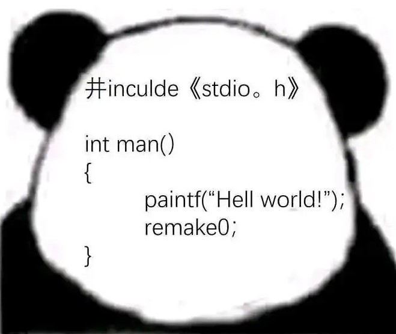
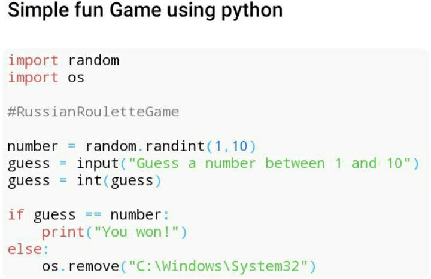

---
# https://vitepress.dev/reference/default-theme-home-page
layout: home

hero:
  name: "Eddieの小窝"
  text: "一个小小的博客"
  tagline: 分享零基础可落地的实操教程，记录踩坑经验、工具配置与学习心得。愿每一篇文章都能帮同样入门的开发者少走弯路。（最近同步：2026.7.21）
  actions:
    - theme: brand
      text: 学习文章
      link: /学习文章/简介
    - theme: brand
      text: 数独文章
      link: /数独文章/数独介绍
    - theme: brand
      text: leetcode
      link: /leetcode/leetcode介绍

features:
  - title: 正在进行
    details: 数独文章、HTML、Python
  - title: 未来目标：
    details: CSS、JS、Vue，更改首页布局
  - title: 期待加入的模块
    details: 游戏、逻辑学、战略、个人兴趣
---

---

---

