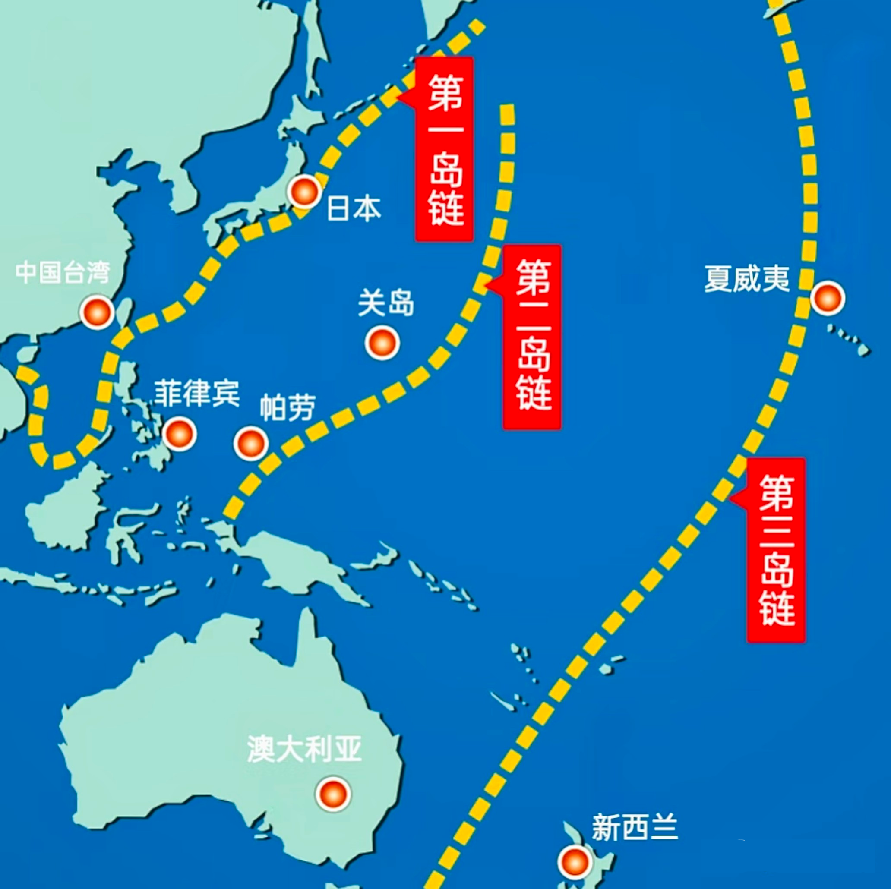

# 中国战略空间和国家安全分析

课程时间：2026.8.20 16:30~17:30

主讲：许少民

## 国家安全的本质

国家安全是指国家政权、主权、统一和领土完整、人民福祉、经济社会可持续发展和国家其他重大利益`相对`处于没有危险和不受`内外`威胁的状态，以及保障持续安全状态的能力。

### 两种不同内涵的安全

**消极安全**

零和博弈甚至负和博弈

**积极安全**

正和博弈

## 国家安全的地缘基础

### 美国战略空间

**太平洋岛链**

{width=400px}

### 中国战略空间，从平面到立体

**平面**

第一环：中国本土

第二环：陆上和海上邻国（14个陆上邻国，6个海上邻国）

第三环：六大区域

第四环：欧洲、非洲、中东、美洲

**立体**

第五环：极地、深海、太空、网络

## 中国战略空间划分与外交布局

**战略空间（地缘圈层，同心圆结构）**

分四大次区域：东北亚、东南亚、南亚、中亚

**新时代中国外交总布局**

四大支柱：大国是关键、周边是首要、发展中国家是基础、多边是重要舞台

## “一带一路”倡议的战略空间想象及其对中美“战略竞争”的意义

形成陆海内外联动、东西双向互济的开放新格局

**“一带一路”倡议的两大战略意义**

1. 以空间换时间：陆海统筹，反制美国印太战略
2. 地缘经济竞争消解地缘政治竞争

## 其他

国家安全日：4.15