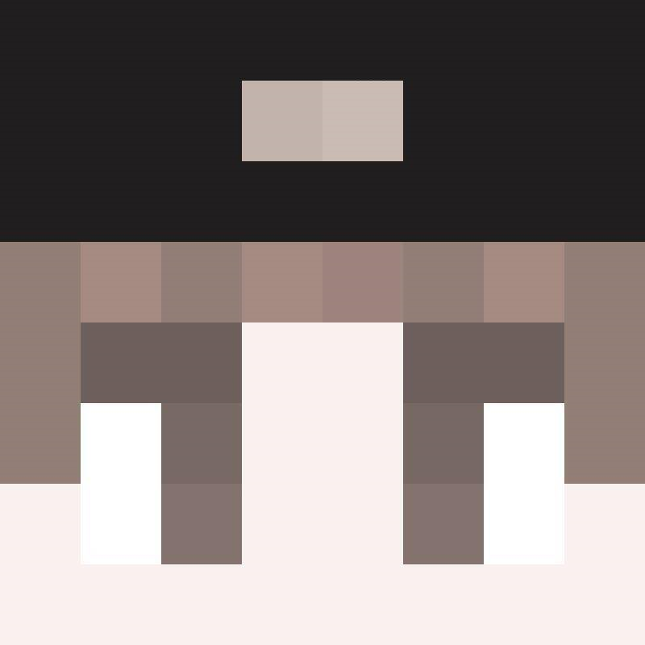
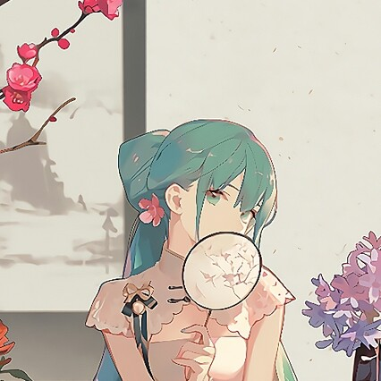

---
# 「友链」页（顶栏「文章专区」右侧入口）。
#
# 目录结构：
#   docs/友链/index.md     ← 本文件（URL 是 /友链；目录下的 index.md 与 友链.md 等价）
#   docs/友链/头像/*.png    ← 友链头像，页内用**相对路径** ./头像/xxx.png 引用
# ⚠️ 别在 docs/ 下同时放 友链.md 和 友链/index.md —— 两个路由同名会打架。
#
# 为什么用 layout: page（和「文章专区」同一个理由）：
#   ① page 布局的内容**不会被 .vp-doc 包住** —— 可以直接用
#      .vitepress/theme/sections.css 里的卡片样式，不会被 .vp-doc a / p
#      的默认样式染成蓝色带下划线的链接；
#   ② 文档页正文容器最宽只有 752~784px，友链卡片会被挤得很窄。
# ⚠️ 代价：本页没有 .vp-doc 的正文排版（段落间距、标题线等）。
#
# 本页**没有**在 config.mjs 的 sidebar 里配 key → 和「文章专区」一样不显示侧边栏。
layout: page
title: 友链
# 背景：docs/assets/img_background/友链页.webp（与「文章专区」同形式：照片层 + 黑纱 + 黑幕淡入 + 浅色标题）。
# 背景规则见 theme/style.css「文章区背景图」一节里新增的「友链」枢纽页一组。
pageClass: friend-hub-bg
---

<section class="home-section">
  <!-- 右侧「隐藏 / 显示」按钮（2026.9.23 十五轮从文章专区复用至此）：功能 / 样式 / 行为同文章专区，
       见 theme/index.js 的 __hubHideBound 与 theme/sections.css 的「文章专区 · 隐藏按钮」一节。 -->
  <button class="hub-hide-btn" type="button" aria-pressed="false" aria-label="隐藏页面内容，只看壁纸" title="隐藏页面内容，只看壁纸">
    <svg class="hub-hide-btn__icon hub-hide-btn__icon--eye" viewBox="0 0 24 24" aria-hidden="true" focusable="false"><path d="M2.6 12S6.4 5.6 12 5.6 21.4 12 21.4 12 17.6 18.4 12 18.4 2.6 12 2.6 12Z" fill="none" stroke="currentColor" stroke-width="1.8" stroke-linejoin="round"/><circle cx="12" cy="12" r="3.1" fill="none" stroke="currentColor" stroke-width="1.8"/></svg>
    <svg class="hub-hide-btn__icon hub-hide-btn__icon--eye-off" viewBox="0 0 24 24" aria-hidden="true" focusable="false"><path d="M2.6 12S6.4 5.6 12 5.6 21.4 12 21.4 12 17.6 18.4 12 18.4 2.6 12 2.6 12Z" fill="none" stroke="currentColor" stroke-width="1.8" stroke-linejoin="round"/><circle cx="12" cy="12" r="3.1" fill="none" stroke="currentColor" stroke-width="1.8"/><path d="M4.4 4.4 19.6 19.6" fill="none" stroke="currentColor" stroke-width="1.9" stroke-linecap="round"/></svg>
    隐藏内容
  </button>
  <h1 class="home-section__title">本站链接</h1>
  <!-- 「本站链接」行：左侧是可见的站点地址（也就是复制内容的唯一来源），右侧「复制」按钮。
       ⚠️ 复制内容不写死在按钮上，而是用 data-copy-from 指向左边那个元素 —— 以后换域名
       只改上面这一处文本即可，按钮不用跟着改。按钮的行为（写剪贴板 + 「已复制」回执）
       由 theme/index.js 里的全局委托处理，本页不需要写任何脚本。 -->
  

    https://meieddie.github.io/
    <button class="copy-btn" type="button" data-copy-from="#site-link-url" title="复制本站链接" aria-label="复制本站链接">
      
      复制链接
    </button>
  

  <h1 class="home-section__title">友情链接</h1>
  
我认识的朋友，和我喜欢的站点

  <!-- ⬇️⬇️⬇️ 维护入口：一个 <a class="friend-card"> = 一条友链，竖向依次排列。
       每条友链四个信息：① 头像 = .friend-avatar 里的 
       （图片放 docs/友链/头像/ 下，路径写**相对本文件**的 ./头像/…；暂时没有图就只留
       首字，补上  后首字自动隐藏，不会破图）；
       ② 名称 = .friend-name（博主/站长昵称） ③ 网站名字 = .friend-site
       ④ 网站URL = .friend-url 里的可见文本，href 必须写同一个地址（外链一律 target="_blank" rel="noopener"）。
       ⚠️⚠️ 从 <section> 到 </section> 之间**绝对不能出现空行**：Markdown 遇到空行就结束「HTML 块」，
       后面缩进 4 格的标签会被当成「缩进代码块」原样打印成文字（本页 2026.9.21 实测踩过一次）。
       新增 / 删除友链 = 增删下面一整段 <a class="friend-card">…</a>，样式不用动。 -->
  

    <a class="friend-card" href="https://meteorliu.zehao.asia/" target="_blank" rel="noopener">
      

        
      

      

        
流星MeteorLiu

        
流星的小屋

        
https://meteorliu.zehao.asia/

      

    </a>
    <a class="friend-card" href="https://asadsoul.github.io/soulsblog.github.io" target="_blank" rel="noopener">
      

        
      

      

        
a_sad_soul

        
soul酱的小站

        
https://asadsoul.github.io/soulsblog.github.io/

      

    </a>
  

  <!-- ⬇️ 「申请友链」区块：静态站没有后端，只能在页面上给出联系方式。
       ⚠️⚠️ 邮箱后面的复制按钮，data-copy-from 必须指向**邮箱元素自己**的 id。
       第一版错写成 #site-link-url（那是上方「本站链接」的站点地址）→ 点按钮复制到的是
       网站地址，而不是旁边显示出来的邮箱。以后再加复制按钮，id 和 data-copy-from 要成对新增，
       别复用别人的 id（全站 id 必须唯一，这个坑不会报错，只会默默复制到错的东西）。
       ⚠️ id 值别用中文/空格，只写 apply-email 这种 ASCII 短名，方便 href/data-* 引用。 -->
  

    <h1 class="home-section__title">申请友链</h1>
    <!-- 说明块用 .note-block（= .game-note 的通用别名，同一套样式）；
         这里原来借用首页「游戏区说明」的 .game-note，名字和页面语义对不上。 -->
    

      
本站是纯静态博客，没有服务端，所以不能在线提交友链申请。想交换友链的话可以：

      <ol>
        <li>发送邮件到 3648939315@qq.com
          <button class="copy-btn" type="button" data-copy-from="#apply-email" title="复制邮箱" aria-label="复制邮箱">
            
            复制邮箱
          </button>
        </li>
        <li>通过其它社交平台找到我（联系方式见：文章专区/本站建设/联系）</li>
      </ol>
      
来信请附上你的 ①网名 ②站点名称 ③网址 ④头像（发送原图片或网址），我看到后会尽快回访并加上。

    

  

</section>
