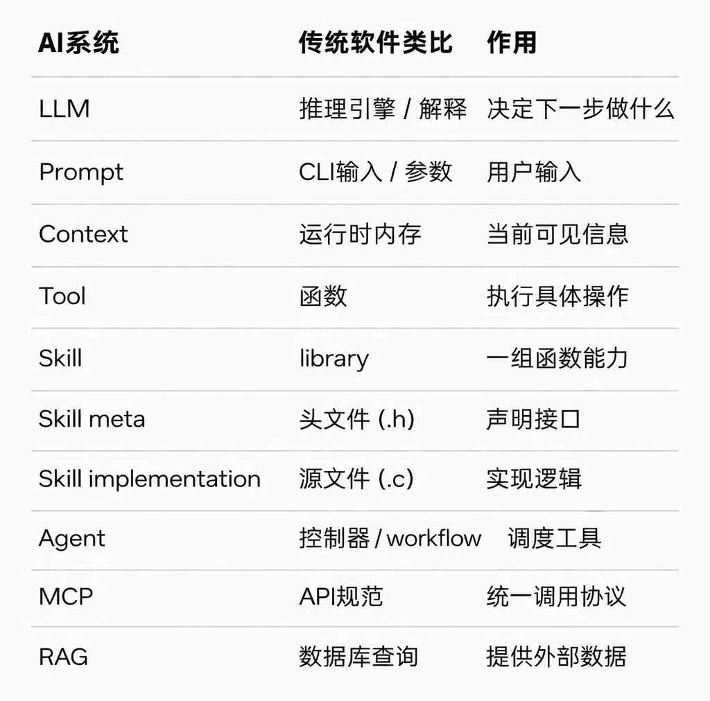
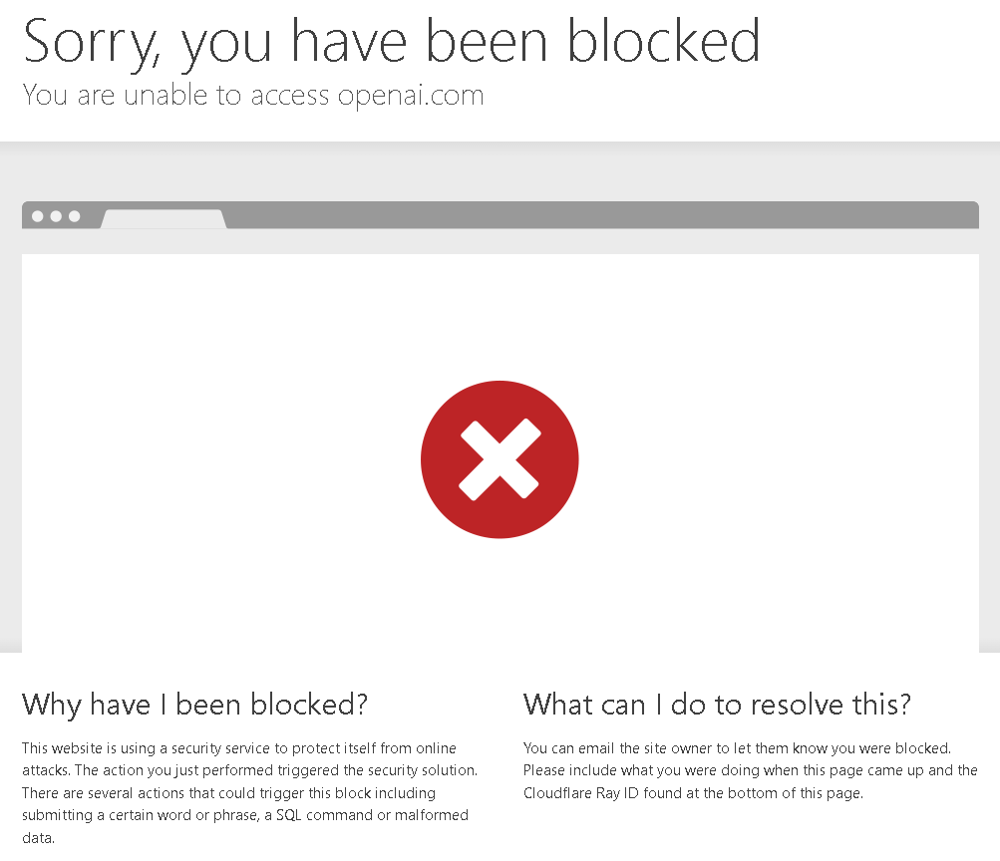

# 从LLM到AgentSkill

## 笔记来源

https://www.bilibili.com/video/BV1E7wtzaEdq/?spm_id_from=333.337.search-card.all.click&vd_source=c5b001da49827c95685ff66b3392ffc9

（bilibili@马克的技术工作坊）

整理成以下笔记

### 概念一览图

{width=500px}

## LLM

Large Language Model（大语言模型），基本上都是基于Transformer架构训练训练出来的。

负责选择工具和归纳总结，不包含查询的功能

## Token可视化网站

https://platform.openai.com/tokenizer?utm_source=copilot.com

::: tip
中国大陆地区原生网络本身无法直连OpenAI官网，直连访问大概率直接触发拦截封禁提示。
:::

{width=500px}

> 触发拦截提示如上图所示

## 两种prompt

### user prompt

用户输入，说明具体任务

### system prompt

后台配置，说明人设和做事规则

## MCP

Model Context Protocol（模型上下文协议）

工具需要接入平台，每个平台的接入规范不同，有一套统一的标准对于开发十分重要，MCP便是统一的接入规范