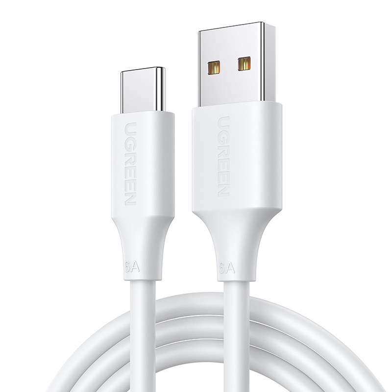
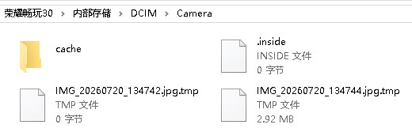
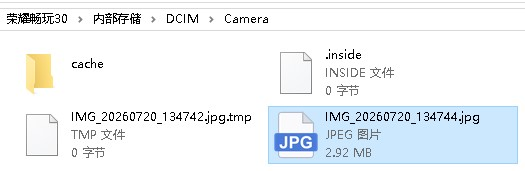

# 图片传输

## 方法

1. 准备数据线

一般情况下你的充电线就是一根数据线，但确实有的只有充电功能，没有数据线路。优先使用手机原装数据线。

{width=200px}

2. 数据线一头插手机Type-C口，另一头直接插电脑主板USB口（台式机优先机箱后面接口）

3. USB连接选项

一般情况下，打开手机就会直接在下方显示链接选项，且默认为`仅充电`

你也可以从手机屏幕顶部往下拉开通知栏，找到通知：通过USB为设备充电，点击这条通知，打开USB连接选项

4. 点击`仅传输照片`选项，此时你的电脑可以访问手机相册

> 你的手机也仍在充电中（一边充电一边传输）

5. 桌面打开电脑`此电脑`（Windows+e），找到你的手机（例如`荣耀畅玩`），里面会出现DCIM等文件夹，剪切到我们的电脑即可

## 可能出现的问题

### 只有充电选项

1. 更换数据线（大概率是充电专用线）
2. 换电脑上另外一个USB接口

## 小知识

### DCIM & Pictures

DCIM就是Digital Camera Images（数字相机图像）

是你亲手用相机拍摄的原图/原视频

而Pictures是非相机拍摄的各类图片

例如截图、网上保存图片、软件下载、表情包、修图后的副本。

> 当然凡事都是有特例的

### 一些文件介绍

如下图

1. **cache文件夹**

cache是缓存文件夹，相机APP运行时自动生成，存放图片预览图、处理过程临时素材、缩略图缓存。

可以删除；删掉后图库加载图片会稍微慢一点，打开相机后系统会自动重建缓存。

2. **.inside（0字节空文件）**

这类0KB隐藏空文件，是相机应用生成的标记/锁文件。

作用：标记文件夹状态、防止进程冲突。文件里面没有任何数据。

3. **IMG_xxxx.jpg.tmp文件**

.tmp是Temporary临时文件

产生原因：

1. 拍照瞬间发生中断
2. 手机拍照时突然锁屏/闪退
3. 拍照过程存储空间不足
4. 文件传输中断（手机连电脑拷贝照片中途断开）

运行逻辑：

相机先写入临时文件.jpg.tmp，照片完整保存成功后，后缀自动去掉.tmp，变成正常jpg图片。

所以当保存失败时，就会遗留这个tmp文件。

##### .tmp两种情况区分

那个有大小的tmp文件（例如那个2.92MB的文件）

可以尝试【重命名】删掉末尾.tmp，变成IMG_xxxx.jpg，看看能不能打开图片，一般来说会有数据损坏。

0字节的.jpg.tmp文件,完全是空文件，没有任何图像数据，无法恢复。

更改后如下图

像这种本身大小比较大的，里面的文件损毁较小，只是有点不清晰 