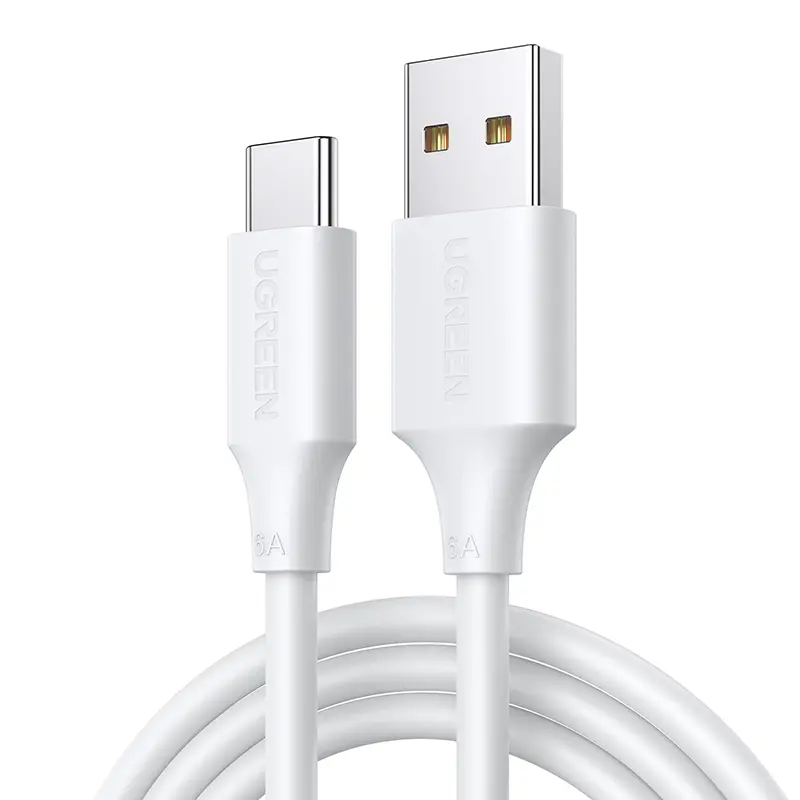
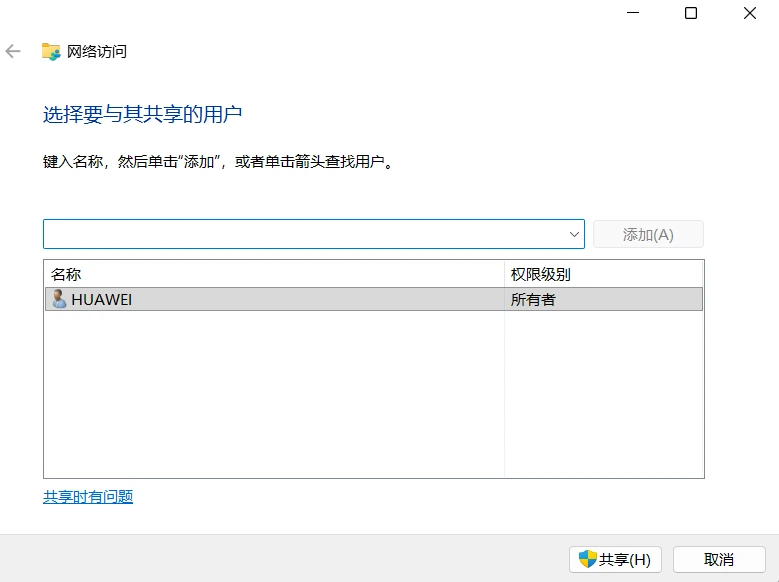
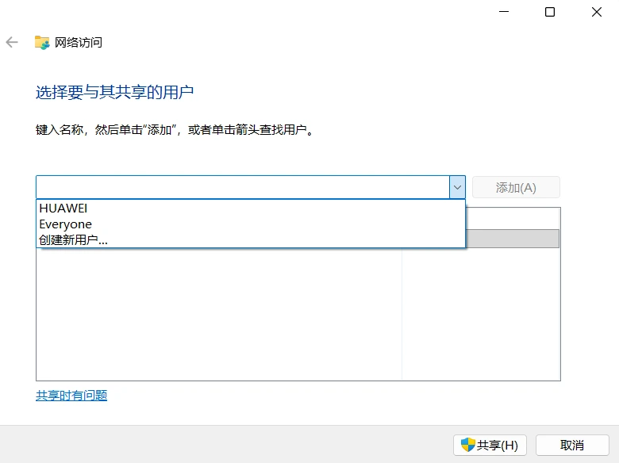
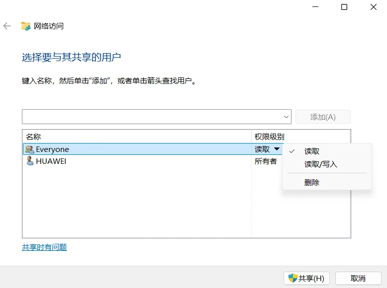
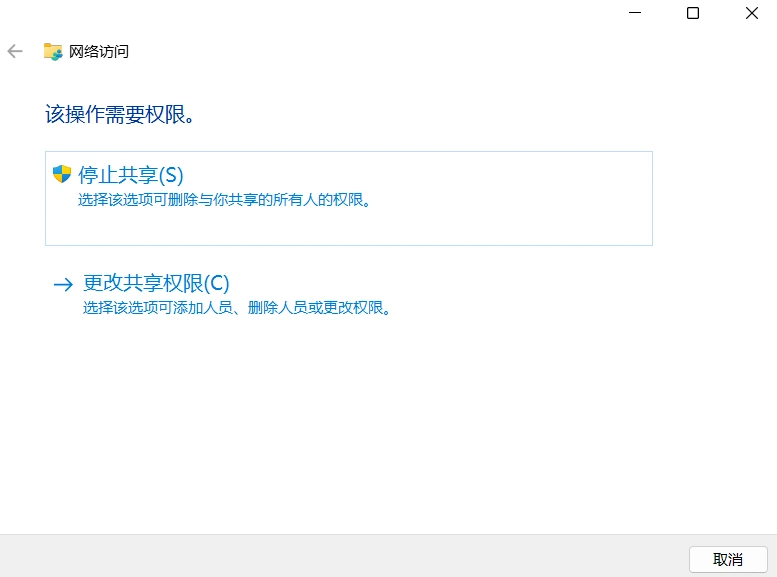
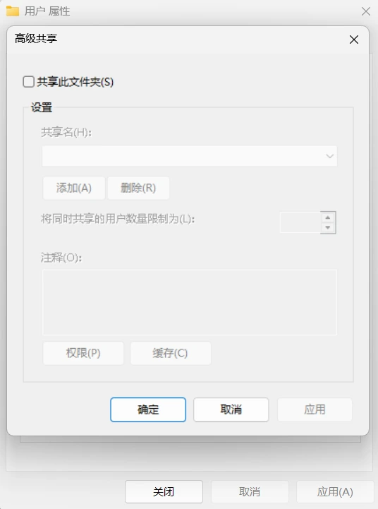
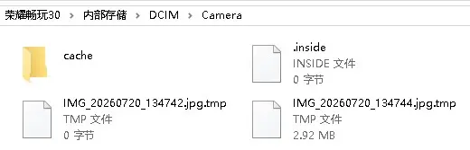
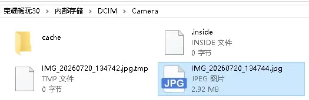

# 文件（图片）传输

## 手机与电脑互传

### 1、微信/QQ文件传输助手

适用于小文件

电脑登录微信/QQ，找到文件传输助手，或者发送给自己，直接拖拽文件即可发送

### 2、通过数据线传输

1. 准备数据线

一般情况下你的充电线就是一根数据线，但确实有的只有充电功能，没有数据线路。优先使用手机原装数据线。

{width=200px}

2. 数据线一头插手机Type-C口，另一头直接插电脑主板USB口（台式机优先机箱后面接口）

3. USB连接选项

一般情况下，打开手机就会直接在下方显示链接选项，且默认为`仅充电`

你也可以从手机屏幕顶部往下拉开通知栏，找到通知：通过USB为设备充电，点击这条通知，打开USB连接选项

4. 点击`仅传输照片`选项，此时你的电脑可以访问手机相册；点击`仅传输文件`选项，此时你的电脑可以访问手机的文件

> 你的手机也仍在充电中（一边充电一边传输）

5. 桌面打开电脑`此电脑`（Windows+e），找到你的手机（例如`荣耀畅玩`），里面会出现DCIM等文件夹，把需要的文件剪切到我们的电脑即可

##### 只有充电选项

一般来说大概率是因为使用了充电专用线，而非数据线，一定只有数据线才能传输文件

```
单靠外观不能100%保证准确区分是否为数据线

推荐看线上的印刷文字标识，数据线会标注 USB2.0/USB3.0/Sync/DataTransfer（同步/数据传输）
```

还有可能是接触不良，包括数据线接口接触不良和USB接口接触不良，此时可以更换电脑上另外一个USB接口尝试

### 3、云盘传输

适合异地互传，但是速度受网速、会员限制，大文件上传下载耗流量，同时，敏感信息容易泄露

## 电脑之间互传

### 1、共享文件（夹）

首先确保两台电脑连接在同一局域网内（连接同一网络）

为了讲解方便，假设你需要将`A电脑`上的文件传输给`B电脑`

::: tip
`A电脑`要设置好开机密码，没有开机密码大概率是不允许共享的
:::

1. 对A电脑操作：右键你需要传输的文件（如果文件在桌面，可以在`此电脑`内右键`桌面`）
2. 点击`授予访问权限`中的`特定用户...`（win11：右键 → 显示更多选项 → 授予访问权限），进入到下方页面

{width=500}

3. 此时，选择`Everyone`，添加，在下方更改权限：更改为`读取/写入`，然后点击最下方的`共享`，此步骤需要管理员权限

{width=500}

{width=500}

成功共享如下：

{width=500}

若是文件夹共享成功，点进共享文件夹后，左下方还会有`已共享`的小提示


**上述步骤成功之后，可以继续进行下一步，对B电脑操作：找到A电脑的共享文件夹：**

方法一（有可能不行）：打开`B电脑`的此电脑，找到`网络`，计算机栏目下面会出现另一台电脑（Home是自己的电脑），点开另一台电脑，输入`A电脑`的用户和开机密码，即可查看共享文件夹

方法二：按下`windows键`+`R`（或者：在开始菜单搜索：命令提示符，进入），输入A电脑的IPv4，输入`A电脑`的用户和开机密码，即可进入共享文件夹

::: tip
关于如何查看A电脑的用户、IPv4：

在A电脑中，按下`windows键`+`R`，输入`cmd`，回车进入命令行（或者：在开始菜单搜索：命令提示符，进入）

输入命令`whoami`，可以查看当前你的用户名是什么（其结构为：你的设备名称\你的用户名）

输入命令`ipconfig`，找到当前的IPv4是什么（示例：192.168.1.100）
:::

**文件传输完毕后，结束共享：**

1. 点击`授予访问权限`中的`删除访问`

{width=500}

2. 点击`停止共享`

##### 只有高级共享的选项

- 磁盘根目录（D:\ 这种盘根）
- 系统文件夹、Program Files
- OneDrive 同步文件夹、网络映射盘
- 压缩包内文件夹

对A电脑上待传输的文件操作：授予访问权限 → 高级共享 → 高级共享（按钮），来到下方的页面

{width=400}

点击`共享此文件`，在权限中允许读取（默认允许）和更改（需要手动允许），最后点击`应用`

**结束共享:**

点击高级共享，取消勾选`共享此文件`，确定

### 2、云盘传输

适合异地互传，但是速度受网速、会员限制，大文件上传下载耗流量，同时，敏感信息容易泄露

## 小知识

### DCIM & Pictures

DCIM就是Digital Camera Images（数字相机图像）

是你亲手用相机拍摄的原图/原视频

而Pictures是非相机拍摄的各类图片

例如截图、网上保存图片、软件下载、表情包、修图后的副本。

> 当然凡事都是有特例的

### 一些文件介绍

如下图



1. **cache文件夹**

cache是缓存文件夹，相机APP运行时自动生成，存放图片预览图、处理过程临时素材、缩略图缓存。

可以删除；删掉后图库加载图片会稍微慢一点，打开相机后系统会自动重建缓存。

2. **.inside（0字节空文件）**

这类0KB隐藏空文件，是相机应用生成的标记/锁文件。

作用：标记文件夹状态、防止进程冲突。文件里面没有任何数据。

3. **IMG_xxxx.jpg.tmp文件**

.tmp是Temporary临时文件

产生原因：

1. 拍照瞬间发生中断
2. 手机拍照时突然锁屏/闪退
3. 拍照过程存储空间不足
4. 文件传输中断（手机连电脑拷贝照片中途断开）

运行逻辑：

相机先写入临时文件.jpg.tmp，照片完整保存成功后，后缀自动去掉.tmp，变成正常jpg图片。

所以当保存失败时，就会遗留这个tmp文件。

##### .tmp两种情况区分

那个有大小的tmp文件（例如那个2.92MB的文件）

可以尝试【重命名】删掉末尾.tmp，变成IMG_xxxx.jpg，看看能不能打开图片，一般来说会有数据损坏。

0字节的.jpg.tmp文件,完全是空文件，没有任何图像数据，无法恢复。

更改后如下图



像这种本身大小比较大的，里面的文件损毁较小，只是有点不清晰 